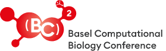

 

# 
BioNetVisA 2021 workshop

## 
From biological network reconstruction to data visualization and analysis in molecular biology and medicine

<!--

<b>The final programme and the abstract booklet are available<a href="/Abstracts/Bionetvisa2020/BioNetVisA2020_booklet.pdf"> here</a></b>

<b>The workshop presentations are available<a href="https://drive.google.com/open?id=1cLa4gSUAeogCNUi1yAFzlidHbOrxakxh"> here</a></b>
 -->

<b>BioNetVisA</b> workshop brings together different actors of network biology from database providers, networks creators, computational biologists, biotech companies involved in data analysis and modeling to experimental biologists, clinicians that use systems biology approaches. The participants are exposed to the different paradigms of network biology and the latest achievements in the field.

### Motivation

The goal of <b>BioNetVisA</b> workshop is to build a discussion around various approaches for biological knowledge formalisation, data integration and analysis; compatibility between different methods and biological networks resources available the field; applicability for concrete research and clinical projects depending on scientific question and type of high-throughput data.

The <b>BioNetVisA</b> workshop aims at identifying bottlenecks and proposing short- and long-term objectives for the community as discussing questions about accessibility of available tools for wide range of user in every-day standalone application in biological and clinical labs. In addition, the possibilities for collective efforts by academic researchers, clinicians, biotech companies and future development directions in the field will be discussed during the round table panel.

<!--
### Audience

The workshop targets computational systems biologists, molecular and cell biologists, clinicians and a wide audience interested in update and discussion around current status of network biology, pathway databases, and related analysis tools, including visualization, statistical analysis and dynamic modelling. No computational background is required to attend the workshop.

-->

### BioNetVisA 2020 Program

<table>
<tr><td><b>8:30 - 9:00</b> 
Registration</td></tr>

<tr><td><strong>Session 1</strong></td></tr>
<tr><td><b>9:00 - 9:30</b> 
<a href="https://www.ebi.ac.uk/about/people/henning-hermjakob">Henning Hermjakob</a>  
<i>EMBL-EBI, Cambridge, UK</i></td></tr>
<tr><td><b>9:30 - 10:00</b> 
<a href="https://www.ntnu.edu/employees/asmund.flobak">Åsmund Flobak</a>  
<i>NTNU, Trondheim, NO</i></td></tr>
<tr><td><b>10:00 - 10:15</b> 
Talk selected from abstracts</td></tr>
</table>

<i>10:15 - 1045: Coffee break</i>

<table>
<tr><td><strong>Session 2</strong></td></tr>
<tr><td><b>10:45 - 11:15</b> 
<a href="https://www.ibens.ens.fr/spip.php?article364">Laura Cantini</a>  
<i>IBENS – ENS, Paris, FR</i></td></tr>
<tr><td><b>11:15 - 11:45</b> 
<a href="http://boevalab.inf.ethz.ch/">Valentina Boeva</a>  
<i>ETH, Zurich, CH</i></td></tr> 
<tr><td><b>11:45 - 12:00</b> 
Talk selected from abstracts</td></tr>
<tr><td><b>12:00 - 12:15</b> 
Talk selected from abstracts</td></tr>
</table>

<i>12:15 - 13:30: Lunch</i>

<table>
<tr><td><strong>Session 3</strong></td></tr>
<tr><td><b>13:30 - 14:00</b> 
<a href="https://genexplain.com/standard_posts/our-team/">Alexander Kel</a>  
<i>neXplain, Wolfenbüttel, DE</i></td></tr>
<tr><td><b>14:00 - 14:30</b> 
<a href="https://biochem.unl.edu/tomas-helikar">Thomas Helikar</a>  
<i>University of Nebraska, Nebraska, US</i></td></tr> 
<tr><td><b>14:30 - 15:00</b> 
<a href="https://rupertoverall.net/">Rupert W Overall</a>  
<i>Technische Universität Dresden, DES</i></td></tr> 
<tr><td><b>15:00 - 15:15</b> 
Talk selected from abstracts</td></tr>
<tr><td><b>15:30 - 15: 45</b> 
Talk selected from abstracts</td></tr>
<tr><td><b>15:45 - 16:00</b> 
Round table</td></tr>
</table>

17:00: Start <a href="https://www.bc2.ch/">bc2</a> (Welcome words and lecture) 
16:30 - 22:00 <a href="https://www.bc2.ch/">bc2</a> Welcome drinks and "party"

### Important dates
<table style="width 100%">
<tr><td><b>August 1</b></td>
  <td>Abstracts submission deadline</td></tr>
<tr><td><b>August 5</b></td>
  <td>Selected speaker's notification</td></tr>
<tr><td><b>September 5</b></td>
  <td>Registration deadline</td></tr>
<tr><td><b>September 13</b></td>
  <td>BioNetVisA 2021 workshop</td></tr>
</table>

### Topics

Graphical representation of biological knowledge 
Molecular interaction and pathway databases 
Comprehensive signalling networks 
Networks annotation and curation 
High-throughput data visualization, analysis and interpretation in the context of networks 
Multi-scale networks (genome, epigenome, transcriptome, proteome, metabolome, lipidome..) 
Contextualization of networks (species, diseases, developmental stages…) 
Networks of inter-cellular communication 
Network modelling 
Machine learning/Artificial Intelligence approaches in network biology  
Basic research and clinical application of networks 
Microbiome and networks 
Single-cell data and network inference 
Networks for drug repositioning and disease coomorbidity 

### Abstract submission

We invite to submit your abstract for a talk or a poster in the topics described above. 
The submission deadline is on August 1st 2021 
Submitted abstracts will be reviewed by the scientific program committee and a notification of acceptance for a talk or a poster will be provided to the corresponding author by August 5th, 2021 
 
Abstract format: 
Title 
List of authors (the first author is the presenting autor) 
Affiliations 
Abstract text in unstructured format (maximum 300 words) 
 
 
<strong>Submission process</strong> 
The link below will take you to the EasyChair submission page. Once logged, click on the 'Submission' tab to start the submission process. Enter authors, title without HTML elements, abstract up to 300 words, keywords, and indicate three-five relevant topics. 
 
To assist us with creating the abstract booklet, please upload the same abstract as a word document in the section called "Upload Paper" using this 
<a href="/AbstractTemplate_BioNetVisA.docx">TEMPLATE</a> 
 
When the form is adequately filled out, press the 'Submit' button. You will receive an email from the conference "EasyChair". This email is solely a notification that EasyChair for BioNetVisA2019 has received the abstract. 
 
Submit your abstract <a href="https://easychair.org/conferences/?conf=bionetvisa2021">here</a> 

### Registration and accomodation

 Please note that all registrations to the workshop and accommodation arrangements have to be done through the <a href="https://www.bc2.ch/">[BC]2</a> registration webpage

### Venue

<a href="https://www.unibas.ch/de">University of Basel</a> 
Kollegienhaus 
Petersplatz 1 
4001 Basel, Switzerland 

### Organising committee

<a href="https://science.curie.fr/recherche/biologie-interactive-des-tumeurs-immunologie-environnement/c/">Emmanuel Barillot</a> (Institut Curie, France) 
<a href="http://www.sbi.jp/">Hioraki Kitano</a> (Laboratory for Disease Systems Modeling, RIKEN Center for Integrative Medical Sciences, Japan) 
<a href="http://sysbio.curie.fr/">Inna Kuperstein</a> (Institut Curie, France) 
<a href="http://sysbio.curie.fr/"> Cristobal Monraz Gomez</a> (Institut Curie, France) 
<a href="http://www.ihes.fr/~zinovyev/">Andrei Zinovyev</a> (Institut Curie, France) 
<a href="http://www.sbi.jp/members.htm">Samik Ghosh</a> (Systems Biology Institute, Tokyo, Japan)  
<a href="https://reactome.org/">Robin Haw</a> (Ontario Institute for Cancer Research, Canada) 
<a href="https://www.bsc.es/valencia-alfonso">Alfonso Valencia</a> (Barcelona Supercomputing Center, Barcelona, Spain) 

<!--
### Workshop link

TBA
  

-->

### Contact us

bionetvisa@curie.fr

