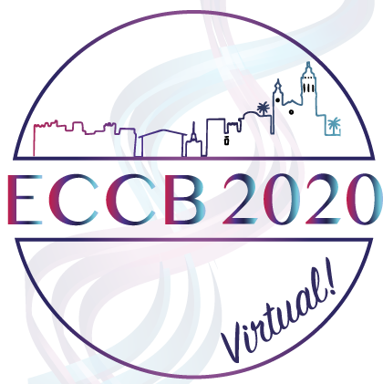

 

# 
BioNetVisA 2020 workshop -virtual

## 
From biological network reconstruction to data visualization and analysis in molecular biology and medicine

<b>The final programme and the abstract booklet are available<a href="/Abstracts/Bionetvisa2020/BioNetVisA2020_booklet.pdf"> here</a></b>

<!--

<b>The workshop presentations are available<a href="https://drive.google.com/open?id=1cLa4gSUAeogCNUi1yAFzlidHbOrxakxh"> here</a></b>
 -->

<b>BioNetVisA</b> workshop brings together different actors of network biology from database providers, networks creators, computational biologists, biotech companies involved in data analysis and modeling to experimental biologists, clinicians that use systems biology approaches. The participants are exposed to the different paradigms of network biology and the latest achievements in the field.

### Motivation

The goal of <b>BioNetVisA</b> workshop is to build a discussion around various approaches for biological knowledge formalisation, data integration and analysis; compatibility between different methods and biological networks resources available the field; applicability for concrete research and clinical projects depending on scientific question and type of high-throughput data.

The <b>BioNetVisA</b> workshop aims at identifying bottlenecks and proposing short- and long-term objectives for the community as discussing questions about accessibility of available tools for wide range of user in every-day standalone application in biological and clinical labs. In addition, the possibilities for collective efforts by academic researchers, clinicians, biotech companies and future development directions in the field will be discussed during the round table panel.

### Audience

The workshop targets computational systems biologists, molecular and cell biologists, clinicians and a wide audience interested in update and discussion around current status of network biology, pathway databases, and related analysis tools, including visualization, statistical analysis and dynamic modelling. No computational background is required to attend the workshop.

### Key Themes

Graphical representation of biological knowledge 
Molecular interaction and pathway databases 
Comprehensive signalling networks 
Networks annotation and curation 
Text mining approaches 
Contextualisation of networks 
High-throughput data visualization, analysis and interpretation in the context of networks 
Multi-scale networks 
Networks of inter-cellular communication 
Network modelling 
Machine learning/Artificial Intelligence approaches in network biology  
Basic research and clinical application of networks 
Microbiome and networks 
Single-cell data and network inference 
Networks for drug repositioning 

### Important dates
<table style="width 100%">
<tr><td><b>June 20</b></td>
  <td>Workshop's registration open</td></tr>
<tr><td><b>TBA</b></td>
  <td>Workshop's registration deadline</td></tr>
<tr><td><b>September 4</b></td>
  <td>BioNetVisA 2020 workshop</td></tr>
</table>

### BioNetVisA 2020 Program

<table>
<tr><td><i>Chairs: Inna Kuperstein and Emmanuel Barillot (Institut Curie, Paris, France)</i></td></tr>
<tr><td><b>13:30 - 13:50</b> 
<strong>COVID-19 Taxila: mining patterns in text in the fight against the pandemic</strong> 
<a href="/Abstracts/Bionetvisa2020/Talk_01_Palaniappan_Ghosh_BioNetVisA2020.pdf"><b>Abstract</b></a> 
<a href="http://www.sbi.jp/members.htm">Sucheendra K. Palaniappan </a> and <a href="http://www.sbi.jp/members.htm">Samik Ghosh</a> 
<i>SBI, Tokyo, Japan</i> 
<i>SBX Corporation, Tokyo, Japan</i></td></tr>
<tr><td><b>13:50 - 14:05 </b> 
<strong>Using inter-cellular communication maps to facilitate network medicine</strong>  
<a href="/Abstracts/Bionetvisa2020/Talk_02_Korcsmaros_BioNetVisA2020.pdf"><b>Abstract</b></a> 
<a href="https://www.earlham.ac.uk/tamas-korcsmaros">Tamas Korcsmaros</a> 
<i>Earlham Institute, Norwich, UK</i></td></tr>
<tr><td><b>14:05 - 14:25 </b> 
<strong>COVID-19 Disease Map, building a computational repository of SARS-CoV-2 virus-host interaction mechanisms</strong>  
<a href="/Abstracts/Bionetvisa2020/Talk_03_Ostaszewski_BioNetVisA2020.pdf"><b>Abstract</b></a> 
<a href="https://wwwfr.uni.lu/lcsb/people/marek_ostaszewski">Marek Ostaszewski</a> 
<i>LCSB, Luxembourg</i></td></tr>
<tr><td><b>14:25 - 14:40</b>  
<strong>AILANI COVID-19 - literature mining and artificial intelligence based question & answering - a scientific assistant for COVID-19 research</strong> 
<a href="/Abstracts/Bionetvisa2020/Talk_04_Bauch_BioNetVisA2020.pdf"><b>Abstract</b></a> 
<a href="https://www.researchgate.net/profile/Angela_Bauch">Angela Bauch</a> and <a href="https://de.linkedin.com/in/dietermaier">Dieter Maier</a> 
<i>Biomax Informatics AG, Planegg, Germany</i></td></tr>
<tr><td><b>14:40 - 14:55 </b> 
<strong>HENA, Heterogeneous Network-Based Data Set for Alzheimer's Disease</strong>  
<a href="/Abstracts/Bionetvisa2020/Talk_05_Sugis_BioNetVisA2020.pdf"><b>Abstract</b></a> 
<a href="https://www.researchgate.net/profile/Elena_Suegis">Elena Sugis</a> and <a href="https://www.unil.ch/cig/en/home/menuinst/research/prof-xenarios.html">Ioannis Xenarios</a> 
<i>UNIL, Lausanne, Switzerland</i></td></tr>
<tr><td><b>14:55 - 15:10 </b> 
<strong>Contextualization of molecular networks for human diseases</strong>  
<a href="/Abstracts/Bionetvisa2020/Talk_06_Licata_BioNetVisA2020.pdf"><b>Abstract</b></a> 
<a href="https://www.researchgate.net/profile/Luana_Licata">Luana Licata</a> 
<i>University of Rome Tor Vergata, Rome, Italy</i></td></tr>
<tr><td><b>15:10 - 15:20</b> 
<strong>BioKC: a platform for quality controlled curation and annotation of systems biology models</strong>  
<a href="/Abstracts/Bionetvisa2020/Talk_07_Vega_BioNetVisA2020.pdf"><b>Abstract</b></a>   
<a href="https://wwwfr.uni.lu/lcsb/people/carlos_vega_moreno">Carlos Vega</a> 
<i>LCSB, Luxembourg</i></td></tr>
<tr><td><b>15:20 - 15:30</b> 
<strong>RA-map: building a state-of-the-art interactive knowledge base for rheumatoid arthritis</strong>  
<a href="/Abstracts/Bionetvisa2020/Talk_08_Singh_BioNetVisA2020.pdf"><b>Abstract</b></a> 
<a href="https://www.genhotel.univ-evry.fr/team/team/members/vidisha-singh.html">Vidisha Sing</a> 
<i>University Evry - Paris Saclay, France</i></td></tr>
<tr><td><b>15:30 - 15:40 </b> 
<strong>Comprehensive map of the Regulated Cell Death Signaling Network: a powerful analytical tool for studying diseases </strong> 
<a href="/Abstracts/Bionetvisa2020/Talk_09_Monraz_BioNetVisA2020.pdf"><b>Abstract</b></a> 
<a href="http://sysbio.curie.fr/">Cristobal Monraz</a> 
<i>Institut Curie, Paris, France</i></td></tr>
<tr><td><b>15:40 - 15:50</b> 
<strong>The dynamics of multilayer network community structure</strong>  
<a href="/Abstracts/Bionetvisa2020/Talk_10_Cirillo_BioNetVisA2020.pdf"><b>Abstract</b></a> 
<a href="https://www.bsc.es/cirillo-davide">Davide Cirillo</a> 
<i>BSC, Barcelona, Spain</i></td></tr>
<tr><td><b>15:50 - 16:05 </b> 
<strong>WikiPathways: Pathway Models for Network Analysis</strong>  
<a href="/Abstracts/Bionetvisa2020/Talk_11_Kutmon_BioNetVisA2020.pdf"><b>Abstract</b></a> 
<a href="https://www.maastrichtuniversity.nl/martina.kutmon">Martina Summer-Kutmon</a> 
<i>Maastricht University, Maastricht, the Netherlands</i></td></tr>
<tr><td><b>16:05 - 16:25</b> 
<strong>Reactome Pathway Knowledgebase: Variants, Dark Proteins and Functional Interactions</strong> 
<a href="/Abstracts/Bionetvisa2020/Talk_12_Haw_BioNetVisA2020.pdf"><b>Abstract</b></a> 
<a href="https://www.researchgate.net/profile/Robin_Haw">Robin Haw</a> 
<i>Ontario Institute of Cancer Research, Toronto, Canada</i></td></tr>
<tr><td><b>16:25 - 16:30 </b> 
<strong>Closing remarks</strong> </td></tr>
</table>

### Registration

<a href="https://eccb2020.info/registration/">Register here</a>

### Organising committee

<a href="https://science.curie.fr/recherche/biologie-interactive-des-tumeurs-immunologie-environnement/c/">Emmanuel Barillot</a> (Institut Curie, France) 
<a href="http://www.sbi.jp/">Hioraki Kitano</a> (RIKEN Center for Integrative Medical Sciences, Japan) 
<a href="https://www.bsc.es/valencia-alfonso">Alfonso Valencia</a> (Barcelona Supercomputing Center, Barcelona, Spain) 
<a href="http://www.sbi.jp/members.htm">Samik Ghosh</a> (Systems Biology Institute, Tokyo, Japan) 
<a href="http://sysbio.curie.fr/">Inna Kuperstein</a> (Institut Curie, France) 
<a href="http://sysbio.curie.fr/">Luis Cristobal Monraz Gomez</a> (Institut Curie, France) 
<a href="https://reactome.org/">Robin Haw</a> (Ontario Institute for Cancer Research, Canada) 
<a href="http://www.ihes.fr/~zinovyev/">Andrei Zinovyev</a> (Institut Curie, France) 

### Workshop link

TBA
  

### Contact us

bionetvisa@curie.fr

